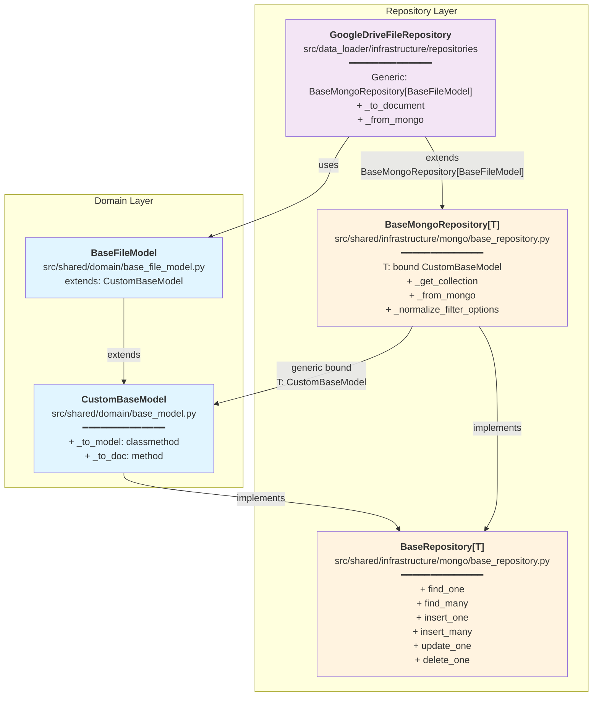

# Dependencies Architecture

## Component Dependencies Diagram



## Architecture Overview

### Domain Layer

**CustomBaseModel** (`src/shared/domain/base_model.py`)
- Abstract base class combining ABC and Pydantic BaseModel
- Defines abstract methods:
  - `_to_model(doc: dict)` - classmethod for converting dict to model
  - `_to_doc()` - instance method for converting model to dict

**BaseFileModel** (`src/shared/domain/base_file_model.py`)
- Extends `CustomBaseModel` with file-specific fields
- Provides immutable value object behavior
- Contains file metadata (id, name, creation date, download path, source, etc.)

### Repository Layer

**BaseRepository[T]** (`src/shared/infrastructure/mongo/base_repository.py`)
- Abstract generic repository interface
- Defines contract for CRUD operations:
  - `find_one(**filter_options)` - find single item
  - `find_many(**filter_options)` - find multiple items
  - `insert_one(document)` - insert single document
  - `insert_many(documents)` - insert multiple documents
  - `update_one(filter_options, update)` - update single item
  - `delete_one(**filter_options)` - delete single item

**BaseMongoRepository[T]** (`src/shared/infrastructure/mongo/base_repository.py`)
- Implements `BaseRepository[T]` with MongoDB specifics
- Generic type `T` bounded to `CustomBaseModel`
- Provides MongoDB-specific methods:
  - `_get_collection()` - retrieves MongoDB collection
  - `_from_mongo(data)` - converts MongoDB document to model
  - `_normalize_filter_options(options)` - normalizes filter queries

### Concrete Implementation

**GoogleDriveFileRepository** (`src/data_loader/infrastructure/repositories/mongo_file_repository.py`)
- Extends `BaseMongoRepository[BaseFileModel]`
- Concrete implementation for file metadata persistence
- Custom methods:
  - `_to_document(item)` - converts BaseFileModel to MongoDB document
  - `_from_mongo(data)` - converts MongoDB document to correct file subclass (GoogleDriveFile, S3File, ApiFile)

## Dependency Flow

```
CustomBaseModel (abstract)
    ↓
    ├─→ implements → BaseRepository[T]
    │
    └─→ extends ← BaseFileModel
        ↓
        uses ← GoogleDriveFileRepository
            ↓
            extends ← BaseMongoRepository[BaseFileModel]
                ↓
                implements → BaseRepository[T]
```

## Key Design Principles

1. **Abstraction**: Generic types allow repository pattern to work with any CustomBaseModel subclass
2. **Persistence**: CustomBaseModel defines the contract for serialization/deserialization
3. **MongoDB Integration**: BaseMongoRepository handles all MongoDB-specific operations
4. **Type Safety**: Generics ensure type constraints at compile time
5. **Single Responsibility**: Each class has a focused purpose in the architecture
