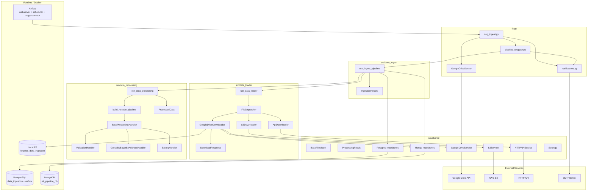
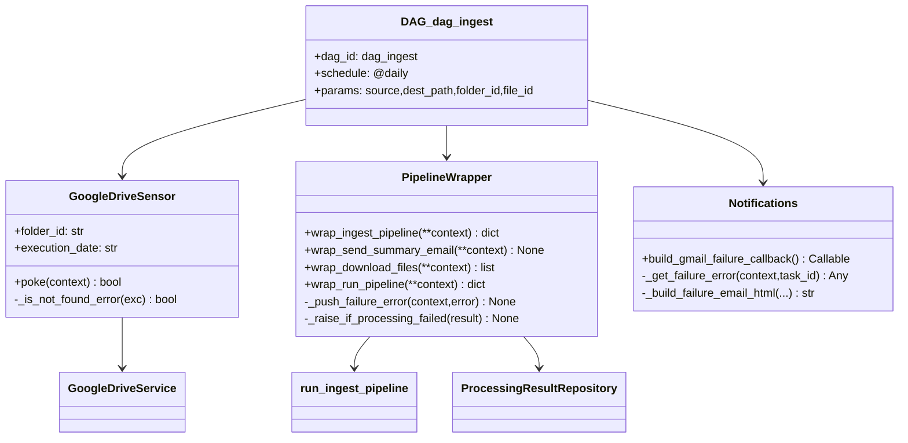
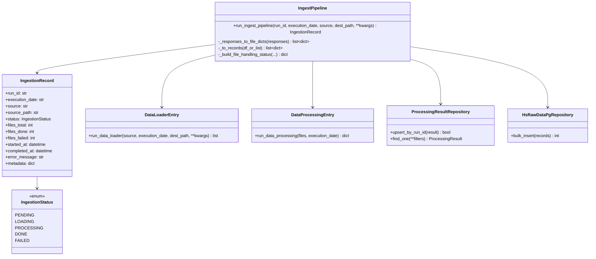
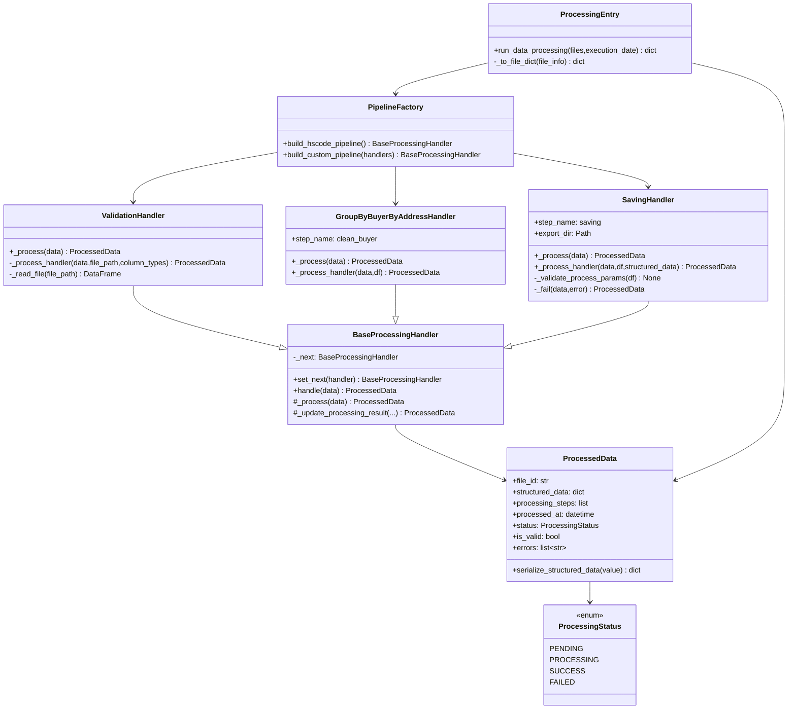
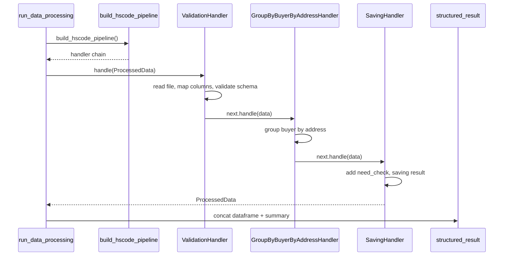
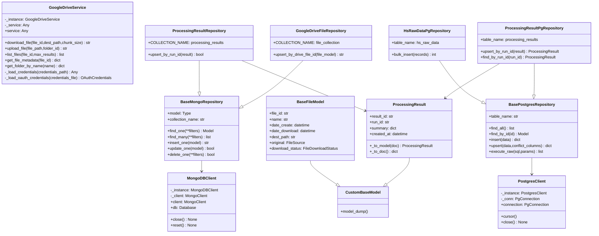
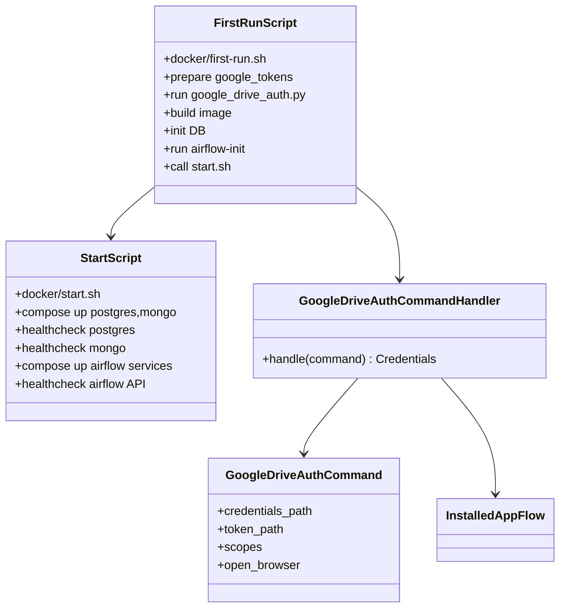
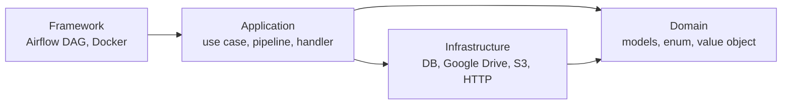

```mermaid
classDiagram
    class FileSource {
        <<enum>>
        GOOGLE_DRIVE
        S3
        API
    }

    class FileDownloadStatus {
        <<enum>>
        PENDING
        DOWNLOADING
        SUCCESS
        FAILED
    }

    class BaseFileModel {
        +file_id: str
        +name: str
        +date_create: datetime
        +date_download: datetime
        +dest_path: str
        +original: FileSource
        +download_status: FileDownloadStatus
    }

    class GoogleDriveFile {
        +drive_file_id: str
        +mime_type: str
        +size_bytes: int
        +_to_model(doc) GoogleDriveFile
        +_to_doc() dict
    }

    class S3File {
        +bucket: str
        +key: str
        +size_bytes: int
    }

    class ApiFile {
        +endpoint_url: str
        +content_type: str
        +request_params: dict
    }

    class DownloadResponse {
        +id: str
        +local_path: str
        +file_download_status: FileDownloadStatus
        +_to_model(doc) DownloadResponse
        +_to_doc() dict
    }

    class Downloader {
        <<protocol>>
        +download(file,dest_path,**kwargs) list~DownloadResponse~
    }

    class FileDispatcher {
        -_registry: dict
        +register(source, downloader) None
        +regist_all() None
        +get_file_info(source, **kwargs) BaseFileModel
        +download(file, dest_path, **kwargs) list~DownloadResponse~
        +is_registered(source) bool
    }

    class GoogleDriveDownloader {
        +repo: GoogleDriveFileRepository
        +get_file_info(**kwargs) GoogleDriveFile
        +download(file,dest_path,**kwargs) list~DownloadResponse~
        -_download_handler(file_model,dest_path,responses,mode) str
    }

    class S3Downloader {
        +download(file,dest_path,**kwargs) list~DownloadResponse~
        +list_files(source_path,**kwargs) list~S3File~
    }

    class ApiDownloader {
        +download(file,dest_path,**kwargs) list~DownloadResponse~
        +list_files(source_path,**kwargs) list~ApiFile~
    }

    class GoogleDriveFileRepository {
        +upsert_by_drive_file_id(file_model) str
    }

    BaseFileModel --> FileSource
    BaseFileModel --> FileDownloadStatus
    GoogleDriveFile --|> BaseFileModel
    S3File --|> BaseFileModel
    ApiFile --|> BaseFileModel
    DownloadResponse --> FileDownloadStatus
    FileDispatcher --> Downloader
    GoogleDriveDownloader ..|> Downloader
    S3Downloader ..|> Downloader
    ApiDownloader ..|> Downloader
    GoogleDriveDownloader --> GoogleDriveFileRepository
    GoogleDriveDownloader --> GoogleDriveService
```

# Kiến trúc module và quan hệ class

Tài liệu này mô tả kiến trúc hiện tại của project STSDataIngestion ở mức module, component và class chính. Mục tiêu là giúp người mới đọc repo hiểu được:

- Module nào chịu trách nhiệm gì
- Các module gọi nhau theo chiều nào
- Dữ liệu đi từ Airflow đến loader, processor, database ra sao
- Class chính trong từng module có quan hệ thế nào
- Điểm nào là boundary giữa domain, application và infrastructure

## 1. Component Diagram tổng thể

### Luồng chính

1. Airflow chạy `dag_ingest`.
2. `GoogleDriveSensor` poll Google Drive để tìm file theo ngày chạy.
3. `wrap_ingest_pipeline` gọi `run_ingest_pipeline`.
4. `run_ingest_pipeline` gọi `run_data_loader` để tải file về local.
5. `run_data_loader` dùng `FileDispatcher` chọn downloader phù hợp.
6. Với Google Drive, `GoogleDriveDownloader` dùng `GoogleDriveService`, tải file về local và lưu metadata vào MongoDB.
7. `run_ingest_pipeline` gọi `run_data_processing`.
8. `run_data_processing` tạo chain handler, xử lý file thành dataframe chuẩn.
9. Kết quả được lưu vào MongoDB (`ProcessingResult`) và PostgreSQL (`hs_raw_data`).
10. Task summary email đọc XCom/MongoDB và gửi báo cáo.

## 2. Module `dags`

Module `dags` là boundary giữa Airflow và application code trong `src`. Airflow không chứa business logic chính; nó chỉ điều phối, chuyển context, push XCom và cấu hình callback.

### Class / Function Diagram

### Trách nhiệm

- `dag_ingest.py`
  - Khai báo DAG chính.
  - Cấu hình `GoogleDriveSensor`.
  - Cấu hình task `run_ingest_pipeline`.
  - Cấu hình task gửi email summary.
  - Gắn failure callback.

- `dags/wrapper/google_drive_sensor.py`
  - Sensor Airflow để kiểm tra file mới trong Google Drive folder.
  - Push `file_ids` vào XCom nếu tìm thấy file đúng `execution_date`.
  - Nếu lỗi, ghi `failure_error` vào Airflow context và XCom rồi raise lại để Airflow mark failed.

- `dags/wrapper/pipeline_wrapper.py`
  - Bridge từ Airflow context sang application code.
  - Gọi `run_ingest_pipeline`.
  - Nếu result có `status=failed`, `status=partial`, hoặc `files_failed > 0`, wrapper raise lỗi để Airflow nhận task failed.
  - Build email summary sau khi pipeline xong.

- `dags/utils/notifications.py`
  - Build failure callback.
  - Lấy lỗi từ `context["failure_error"]`, `context["error"]`, hoặc XCom.
  - Gửi email failure qua Airflow email backend.

### Điểm cần nhớ

Airflow chỉ fail task khi callable raise exception. Nếu application trả object có `status="failed"` nhưng không raise, Airflow vẫn coi task là success. Vì vậy wrapper có `_raise_if_processing_failed` và `_push_failure_error`.

## 3. Module `data_ingest`

`data_ingest` là module orchestration nghiệp vụ. Nó không biết Airflow, nhưng biết thứ tự pipeline: load -> process -> persist.

### Class Diagram

### Trách nhiệm

- `run_ingest_pipeline`
  - Tạo `IngestionRecord` ban đầu.
  - Gọi loader để tải file.
  - Convert `DownloadResponse` sang dict để processing đọc được.
  - Gọi processing.
  - Lấy dataframe kết quả và lưu:
    - summary vào MongoDB qua `ProcessingResultRepository`
    - rows chuẩn vào PostgreSQL qua `HsRawDataPgRepository`
  - Build `metadata` cho email summary.

- `IngestionRecord`
  - Aggregate root cho một lần chạy ingest.
  - Lưu trạng thái tổng quan, số file, lỗi, metadata.

### Luồng lỗi

`run_ingest_pipeline` hiện trả `IngestionRecord(status=FAILED)` khi có exception. Vì vậy Airflow wrapper phải kiểm tra status và raise lại. Thiết kế này giúp pure Python caller vẫn có thể nhận failed record, còn Airflow caller thì nhận exception.

## 4. Module `data_loader`

`data_loader` chịu trách nhiệm lấy thông tin file từ source và tải file về local. Module này dùng registry pattern để chọn downloader theo `FileSource`.

### Class Diagram

### Trách nhiệm

- `run_data_loader`
  - Tạo `FileDispatcher`.
  - Register toàn bộ downloader.
  - Convert source string sang `FileSource`.
  - Lấy file info từ source.
  - Gọi downloader tải file.

- `FileDispatcher`
  - Registry source -> downloader.
  - Giữ application code không cần if/else theo source.
  - Thêm source mới bằng cách tạo downloader mới và register.

- `GoogleDriveDownloader`
  - Lấy metadata file/folder từ Google Drive.
  - Nếu là folder thì tải recursively.
  - Chỉ xử lý CSV file.
  - Lưu metadata download vào MongoDB.
  - Trả danh sách `DownloadResponse`.

- `S3Downloader`
  - Tải file từ S3 qua `s3_service`.

- `ApiDownloader`
  - Tải file từ HTTP API qua `http_api_service`.

### Điểm mở rộng

Muốn thêm source mới:

1. Tạo model kế thừa `BaseFileModel`.
2. Tạo downloader implement interface tương tự `download()` và `get_file_info()` hoặc `list_files()`.
3. Register downloader trong `FileDispatcher.regist_all()`.

## 5. Module `data_processing`

`data_processing` xử lý file local thành dữ liệu chuẩn để insert database. Kiến trúc chính là Chain of Responsibility.

### Class Diagram

### Trách nhiệm

- `run_data_processing`
  - Nhận danh sách file từ loader.
  - Chuẩn hóa từng file thành dict có `file_id`, `local_path`, `file_path`.
  - Tạo `ProcessedData` ban đầu.
  - Gọi pipeline handler chain.
  - Gom dataframe thành một dataframe tổng.
  - Trả dict gồm `status`, `success`, `failed`, `files`, `errors`, `structured_data`.

- `BaseProcessingHandler`
  - Template method cho handler.
  - `handle()` gọi `_process()`, sau đó chuyển cho `_next`.
  - Cho phép nối chain bằng `set_next()`.

- `ValidationHandler`
  - Đọc file bằng pandas.
  - Mapping tên cột raw sang tên chuẩn.
  - Kiểm tra missing columns.
  - Kiểm tra type cơ bản.
  - Tạo `processing_step["validation_handler"]`.

- `GroupByBuyerByAddressHandler`
  - Group dữ liệu theo `importer_address_vn`.
  - Đếm số buyer khác nhau trên cùng một địa chỉ.
  - Gắn `buyer_count` vào dataframe.
  - Ghi summary vào `processing_step["group_buyer_by_address"]`.

- `SavingHandler`
  - Gắn cột `need_check`.
  - Tạo `saving_export_dataframe`.
  - Ghi summary vào `processing_step["saving_handler"]`.

### Luồng xử lý dữ liệu

## 6. Module `shared`

`shared` chứa domain model dùng chung, infrastructure client, repository và external service wrapper. Đây là module nền cho loader, processing và ingest.

### Class Diagram

### Trách nhiệm

- Domain shared
  - `BaseFileModel`: model nền cho file từ Google Drive, S3, API.
  - `ProcessingResult`: model lưu summary processing.

- Service shared
  - `GoogleDriveService`: OAuth, refresh token, list/download/upload file.
  - `S3Service`: wrapper AWS S3.
  - `HTTPAPIService`: wrapper HTTP endpoint.
  - Các service này được gọi từ downloader hoặc sensor.

- Mongo infrastructure
  - `MongoDBClient`: singleton/lazy proxy kết nối MongoDB.
  - `BaseMongoRepository`: CRUD generic.
  - `GoogleDriveFileRepository`: lưu metadata file Google Drive.
  - `ProcessingResultRepository`: lưu summary kết quả pipeline.

- PostgreSQL infrastructure
  - `PostgresClient`: singleton connection PostgreSQL.
  - `BasePostgresRepository`: CRUD/upsert/raw SQL generic.
  - `HsRawDataPgRepository`: bulk insert rows chuẩn vào `hs_raw_data`.
  - `ProcessingResultPgRepository`: lưu `ProcessingResult` vào Postgres nếu cần.

## 7. Script setup và auth

Ngoài runtime Airflow, project có một lớp script để đưa local environment vào trạng thái chạy được.

### Diagram

### Trách nhiệm

- `docker/first-run.sh`
  - Chạy một lần đầu.
  - Chuẩn bị Google OAuth token.
  - Build image.
  - Init Postgres, MongoDB, Airflow metadata DB.
  - Gọi `docker/start.sh`.

- `docker/start.sh`
  - Dùng các lần sau.
  - Start service và health-check.
  - Không chạy init DB lại.

- `scripts/google_drive_auth.py`
  - Chạy OAuth consent screen.
  - Tạo `google_tokens/client_secret.token.json`.
  - Nếu token expired/revoked thì xóa token và xin lại consent.

## 8. Mapping module theo Clean Architecture

### Domain

- Không nên import Airflow, Docker, Google API, MongoDB client.
- Chứa model và enum nghiệp vụ.
- Ví dụ: `IngestionRecord`, `ProcessedData`, `BaseFileModel`, `ProcessingResult`.

### Application

- Điều phối use case.
- Gọi domain model và infrastructure port/service.
- Ví dụ: `run_ingest_pipeline`, `run_data_loader`, `run_data_processing`, handlers.

### Infrastructure

- Kết nối hệ thống ngoài.
- Ví dụ: MongoDB, PostgreSQL, Google Drive, S3, SMTP.

### Framework

- Airflow DAG, Docker Compose, shell script.
- Không nên chứa business logic sâu.

## 9. Bảng tóm tắt module

| Module | Vai trò | Input chính | Output chính |
|---|---|---|---|
| `dags` | Điều phối Airflow | Airflow context, params | XCom, task status, email |
| `data_ingest` | Orchestrate pipeline | source, execution_date, dest_path | `IngestionRecord` |
| `data_loader` | Tải file từ source | file_id/folder_id/source | `DownloadResponse` |
| `data_processing` | Validate/transform dataframe | local files | dict result + dataframe |
| `shared/domain` | Model dùng chung | raw dict/object | Pydantic models |
| `shared/infrastructure` | DB/service integration | env settings | client/repository/service |
| `docker` | Local runtime scripts | `.env`, Docker | running stack |
| `scripts` | Utility local | OAuth client secret | OAuth token |

## 10. Quy tắc khi phát triển thêm

- Thêm source download mới: thêm model + downloader + register trong `FileDispatcher`.
- Thêm processing step mới: tạo handler kế thừa `BaseProcessingHandler`, nối vào `pipeline_factory`.
- Thêm bảng Postgres mới: tạo repository kế thừa `BasePostgresRepository`.
- Thêm collection Mongo mới: tạo repository kế thừa `BaseMongoRepository`.
- Logic Airflow chỉ nên nằm ở wrapper/sensor/callback; business logic nên nằm trong `src`.
- Nếu task Airflow cần fail, callable phải raise exception; chỉ trả object `status=failed` là chưa đủ.
